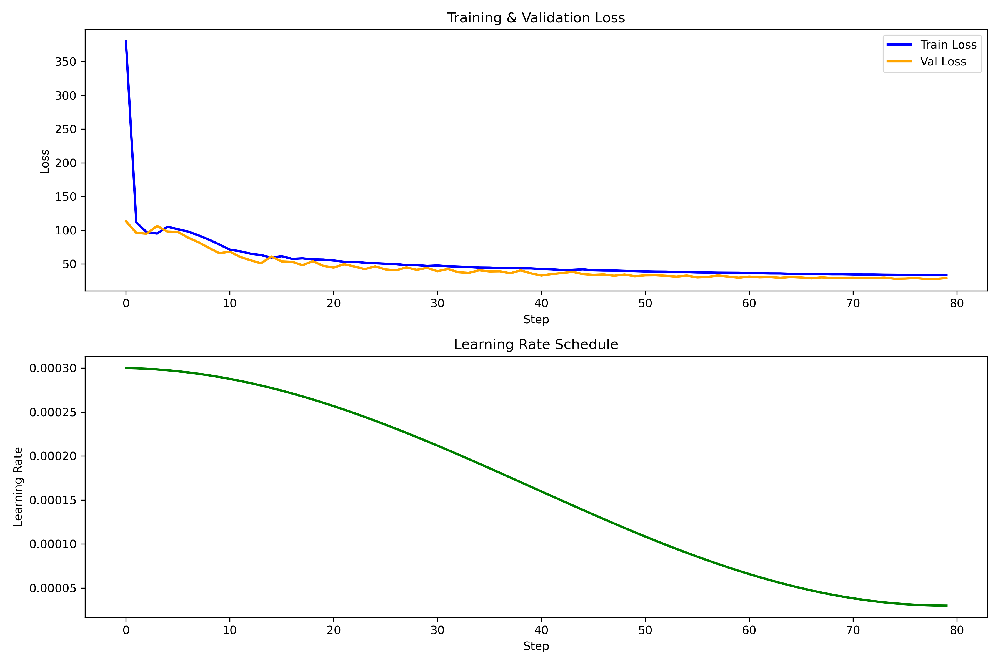

# Language Model Training & Generation

A from-scratch implementation of a Transformer decoder-based language model using PyTorch. This project includes model architecture, training script, and text generation.

## Model Architecture

The model follows standard decoder-only Transformer design:

- **Token Embedding Layer** - Learnable token embeddings
- **Positional Embedding Layer** - Sinusoidal position encodings
- **Transformer Decoder Blocks** - Each containing:
  - Multi-Head Causal Self-Attention (Flash Attention)
  - Feed-Forward Network
  - Residual Connections
  - Layer Normalization
- **Output Layer** - Linear projection to vocabulary space

### Key Features

- **Flash Attention** - Uses `F.scaled_dot_product_attention` for optimized attention computation
- **Mixed Precision Training** - bfloat16 autocast for memory efficiency
- **Gradient Clipping** - Prevents exploding gradients
- **Weight Decay** - L2 regularization via AdamW
- **Learning Rate Scheduling** - Cosine annealing
- **Model Compilation** - `torch.compile` for faster execution
- **TF32 MatMul Precision** - Optimized matrix multiplication on NVIDIA GPUs
- **Gradient Accumulation** - Effective larger batch size
- **Random Sampling** - Batches sampled randomly from dataset
- **Checkpointing** - Periodic saves + best model tracking

### Default Hyperparameters

| Parameter | Value |
|-----------|-------|
| Batch Size | 4 |
| Sequence Length | 1024 |
| Embedding Dimension | 768 |
| Number of Attention Heads | 12 |
| Number of Transformer Layers | 12 |
| Dropout | 0.1 |
| Learning Rate | 3.00 × 10⁻⁴ |
| Weight Decay | 0.1 |
| Gradient Clipping | 1.0 |
| Effective Batch Size (tokens) | 524,288 |
| Gradient Accumulation Steps | 128 |

> Note: Adjust `batch_size` to fit your GPU memory; gradient accumulation steps will automatically adjust to maintain the effective batch size.

---

## Training

### Training Configuration

- **Optimizer:** AdamW with betas=(0.9, 0.95), eps=1e-8
- **Precision:** bfloat16 mixed precision
- **Batching:** Random sampling from dataset
- **Checkpointing:**
  - Periodic checkpoints every N steps
  - Best model saved based on training loss
- **Logging:** CSV logging of all training metrics
- **Total Training Time:** Printed at completion

### Sample Training Results

- **Training Steps:** 80
- **Model Parameters:** 124.55 M
- **Train Tokens:** 461,470
- **Val Tokens:** 51,275
- **Total Epochs (how many times the dataset is seen):** 90.89
- **Final Training Loss:** 33.52
- **Final Validation Loss:** 29.05
- **Total Training Time:** 3.91 Hours

Hardware: Trained on a single NVIDIA RTX 4060 GPU

Plots
---



## Dataset

The training data consists of 9 podcast transcripts:
- Lex Friedman Podcast
- Dwarkesh Patel

The dataset is tokenized using GPT-2 tokenizer (tiktoken).

## Generation

A standalone generation script is provided for text generation using trained models.

### Usage

```bash
python gpt2/gpt2_generate.py
```
## Training Plots

Run `python gpt2/gpt2_plot_training.py` to generate visualization of training metrics. The script loads `training_log.csv` and creates plots showing:
- Training & validation loss
- Learning rate schedule

Plots are saved to `gpt2/checkpoints/training_plots.png`.

## Repository Structure

```
basic-lm/
├── gpt2/
│   ├── checkpoints/
│   │   ├── best_model.pt
│   │   └── checkpoint_step_N.pt
│   ├── dataset.txt
│   ├── gpt2.py
│   ├── gpt2_train.py
│   ├── gpt2_generate.py
│   ├── generated_sample.txt
│   └── gpt2_plot_training.py
├── README.md
└── LICENSE
```

## Quick Start

### Train Model
```bash
python gpt2/gpt2_train.py
```

### Generate Text
```bash
python gpt2/gpt2_generate.py
```

## Generated Sample

```
,. the- that to of and like's a areand is they ifentious in then luxury Highland#$#$of there very for solves Turtle Broadcastingopez bass this allthat 219 an you Yeah we incyu Technology Iowa uh I think Lewis it'mME
,. the- that to of and like's a areand is Kelvin theyI in then if Highland territ#$#$'re very forentious there solves Broadcasting luxuryopez bassof this an you Turtle wethat Bristol Yeah Iowayu 219 I think it
```

> Note: This project is a from-scratch implementation built to demonstrate the core ideas and architecture of a decoder-only Transformer language model, not to achieve state-of-the-art generation quality.

## References

### Key Papers

- [Language Models are Unsupervised Multitask Learners](https://cdn.openai.com/better-language-models/language_models_are_unsupervised_multitask_learners.pdf) - Radford et al., 2019 (GPT-2)
- [Language Models are Few-Shot Learners](https://arxiv.org/abs/2005.14165) - Brown et al., 2020 (GPT-3)
- [Attention Is All You Need](https://arxiv.org/abs/1706.03762) - Vaswani et al., 2017

- With additional guidance from [Andrej Karpathy's lectures](https://www.youtube.com/watch?v=l8pRSuU81PU&list=PLAqhIrjkxbuWI23v9cThsA9GvCAUhRvKZ&index=10)

## Roadmap

Planning to extend this project with more advanced modern architectures, including:

- **Gemma 3** — Google DeepMind's open model series
- **Qwen** — Alibaba's open-weight LLM family

The goal is to implement and compare these architectures from scratch alongside the existing GPT-2 baseline.

## License

MIT License
