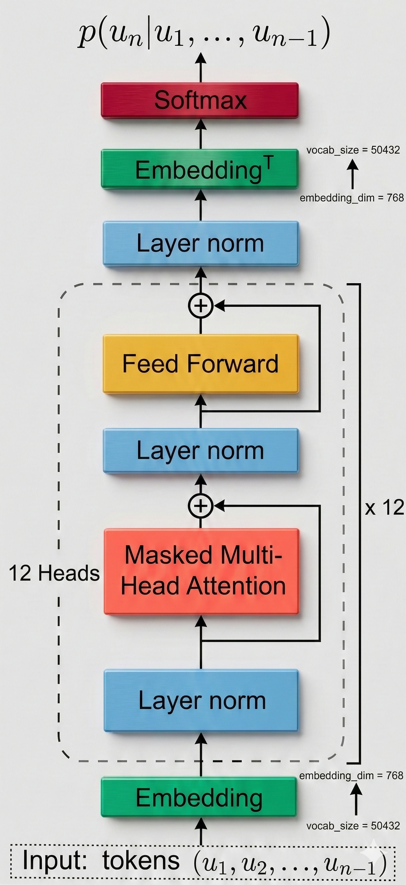
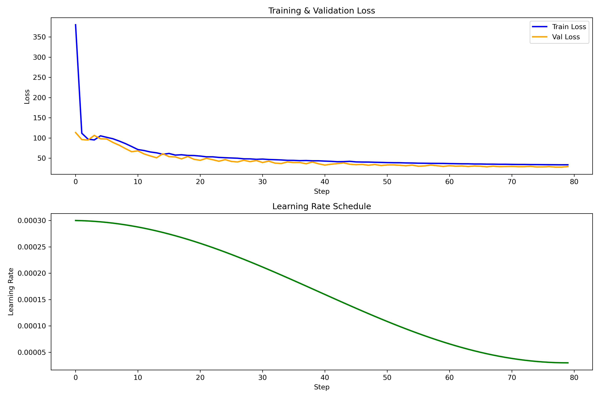

# LLMs From Scratch

A from-scratch implementation of GPT-2 and Llama3 language models using PyTorch. This project includes model architecture, training script, and text samples generation.

# GPT-2

## Model Architecture



The model follows standard decoder-only Transformer design:

- **Token Embedding Layer** - Learnable token embeddings
- **Positional Embedding Layer** - Sinusoidal position encodings
- **Transformer Decoder Blocks** - Each containing:
  - Multi-Head Causal Self-Attention (Flash Attention)
  - Feed-Forward Network
  - Residual Connections
  - Layer Normalization
- **Output Layer** - Linear projection to vocabulary space

### Key Features

- **Flash Attention** - Uses `F.scaled_dot_product_attention` for optimized attention computation
- **Mixed Precision Training** - bfloat16 autocast for memory efficiency
- **Weight Decay** - L2 regularization via AdamW
- **Learning Rate Scheduling** - Cosine annealing
- **Model Compilation** - `torch.compile` for faster execution
- **TF32 MatMul Precision** - Optimized matrix multiplication on NVIDIA GPUs
- **Gradient Accumulation** - Effective larger batch size

### Default Hyperparameters

| Parameter | Value |
|-----------|-------|
| Batch Size | 4 |
| Sequence Length | 1024 |
| Embedding Dimension | 768 |
| Number of Attention Heads | 12 |
| Number of Transformer Layers | 12 |
| Dropout | 0.1 |
| Learning Rate | 3.00 × 10⁻⁴ |
| Minimum Learning Rate | 3.00 × 10⁻⁵ |
| Weight Decay | 0.1 |
| Gradient Clipping | 1.0 |
| Effective Batch Size (tokens) | 524,288 |
| Gradient Accumulation Steps | 128 |

> Note: Adjust `batch_size` to fit your GPU memory; gradient accumulation steps will automatically adjust to maintain the effective batch size.

---

## Training

### Training Configuration

- **Optimizer:** AdamW with betas=(0.9, 0.95), eps=1e-8
- **Precision:** bfloat16 mixed precision

### Sample Training Results

- **Training Steps:** 80
- **Model Parameters:** 124.55 M
- **Train Tokens:** 461,470
- **Val Tokens:** 51,275
- **Total Epochs (how many times the dataset is seen):** 90.89
- **Final Training Loss:** 33.52
- **Final Validation Loss:** 29.05
- **Total Training Time:** 3.91 Hours

Hardware: Trained on a single NVIDIA RTX 4060 8GB GPU

Plots
---



# Llama3

## Model Architecture

A from-scratch Llama 3 (8B) decoder-only Transformer, matching the original model's configuration:

- **Token Embedding Layer** - Learnable token embeddings
- **Transformer Decoder Blocks** - Each containing:
  - Grouped-Query Multi-Head Attention (GQA) with Rotary Positional Embeddings (RoPE)
  - SwiGLU Feed-Forward Network
  - Residual Connections
  - RMSNorm (pre-normalization)
- **Final RMSNorm**
- **Output Layer** - Linear projection to vocabulary space

### Key Features

#### What's New Compared to GPT-2

- **Grouped-Query Attention (GQA)** - 32 query heads sharing 8 key/value heads for efficient attention compared to standard Multi-Head Attention
- **Rotary Positional Embeddings (RoPE)** - Relative position encoding applied to queries and keys (`rope_theta = 500,000`), replacing learned positional embeddings
- **RMSNorm** - Root Mean Square normalization instead of LayerNorm
- **SwiGLU FFN** - SiLU-gated feed-forward network (`W2(SiLU(W1(x)) * W3(x))`), replacing the standard GELU MLP
- **KV Cache** - I also implemented the use of KV cache during inference generation which includes the sequential generation itself and the pre-filling stage.

#### And same as GPT-2

- **Flash Attention** - Uses `F.scaled_dot_product_attention` with native GQA support (`enable_gqa=True`)
- **Mixed Precision Training**
- **Used `torch.compile`**
- **Learning Rate Scheduling** - Linear warmup followed by cosine annealing
- **Gradient Accumulation**

### Default Hyperparameters

| Parameter | Value |
|-----------|-------|
| Number of Transformer Layers | 32 |
| Embedding Dimension | 4096 |
| FFN Hidden Dimension | 14,336 |
| Number of Query Heads | 32 |
| Number of KV Heads (GQA) | 8 |
| Head Size | 128 |
| Sequence Length | 512 |
| Vocabulary Size | 128,256 |
| RoPE Theta | 500,000 |
| Dropout | 0.0 |
| Learning Rate | 3.00 × 10⁻⁴ |
| Minimum Learning Rate | 3.00 × 10⁻⁶ |
| Weight Decay | 0.1 |
| Gradient Clipping | 1.0 |
| Warmup Steps | 5 |
| Effective Batch Size (tokens) | 8,192 |

> Note: `max_seq_len` is reduced to 512 (from 8192 in the original paper) to fit training resources; adjust `batch_size` to fit your GPU memory.

---

## Training

### Training Configuration

- **Optimizer:** AdamW with betas=(0.9, 0.95), eps=1e-5
- **Precision:** bfloat16 mixed precision
- **Tokenizer:** `meta-llama/Meta-Llama-3-8B`
- **Infrastructure:** Trained remotely via [Modal](https://modal.com/) on a single NVIDIA **B200 192 GB** GPU

### Training Results

- **Training Steps:** 300
- **Model Parameters:** 8.03 B
- **Final Training Loss:** 4.02
- **Final Validation Loss:** 5.62
- **Total Training Time:** ~1.18 Hours

> Note: This is a scaled-down training run (300 steps) becaue my dataset is small, intended to validate the architecture rather than reproduce the full Llama 3 model.

## Dataset

The training data is a simple 9 podcast transcripts from:

- Lex Friedman Podcast
- Dwarkesh Patel

## Repository Structure

```
LLMs-from-scratch/
├── gpt2/
│   ├── checkpoints/
│   │   ├── training_log.csv
│   │   └── training_plots.png
│   ├── gpt2.py                  # Model architecture
│   ├── gpt2_train.py            # Training script
│   ├── gpt2_generate.py         # Text generation
│   ├── gpt2_plot_training.py    # Training curves plotting
│   └── generated_sample.txt     # Sample generated text
├── llama3/
│   ├── checkpoints/
│   │   ├── training_log.csv
│   │   └── training_plots.png
│   ├── llama3.py                # Model architecture (GQA, RoPE, RMSNorm, SwiGLU)
│   ├── llama3_train.py          # Training script
│   ├── llama3_generate.py       # Text generation (with KV cache)
│   ├── llama3_plot_training.py  # Training curves plotting
│   ├── modal_run.py             # Modal remote training entrypoint
│   └── generated_sample.txt     # Sample generated text
├── images/
├── dataset.txt                  # Training data (podcast transcripts)
├── README.md
└── LICENSE
```

> Note: This project is a from-scratch implementation built to demonstrate the core ideas and architecture of a decoder-only Transformer language model, not to achieve state-of-the-art generation quality.

## References

### Key Papers

- [Language Models are Unsupervised Multitask Learners](https://cdn.openai.com/better-language-models/language_models_are_unsupervised_multitask_learners.pdf) - Radford et al., 2019 (GPT-2)
- [Language Models are Few-Shot Learners](https://arxiv.org/abs/2005.14165) - Brown et al., 2020 (GPT-3)
- [Attention Is All You Need](https://arxiv.org/abs/1706.03762) - Vaswani et al., 2017
- [LLaMA: Open and Efficient Foundation Language Models](https://arxiv.org/abs/2302.13971) - Touvron et al., 2023 (Llama 1)
- [Llama 2: Open Foundation and Fine-Tuned Chat Models](https://arxiv.org/abs/2307.09288) - Touvron et al., 2023 (Llama 2)
- [The Llama 3 Herd of Models](https://arxiv.org/abs/2407.21783) - Grattafiori et al., 2024 (Llama 3)

- With additional guidance from [Andrej Karpathy's lectures](https://www.youtube.com/watch?v=l8pRSuU81PU&list=PLAqhIrjkxbuWI23v9cThsA9GvCAUhRvKZ&index=10)

## Roadmap

Planning to extend this project with more advanced modern architectures, including **Gemma 3** and **Qwen**:

## License

MIT License
